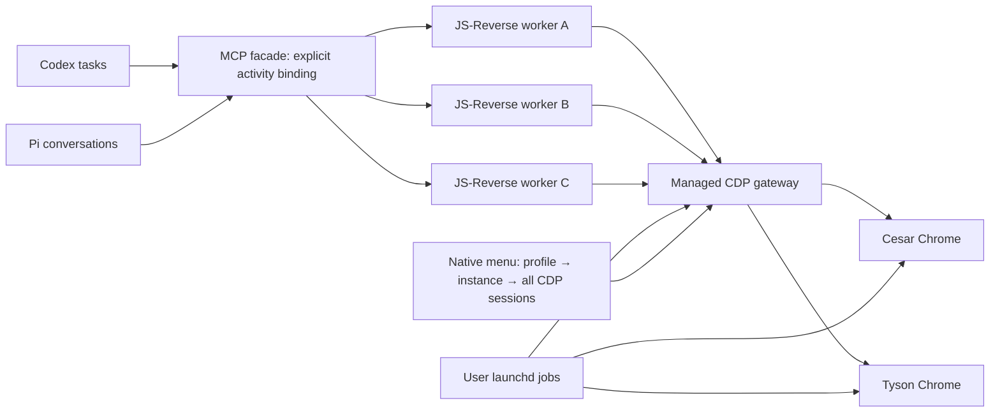

# Managed profile browsers

The accepted decision is [ADR 0001](adr/0001-shared-profile-browsers.md). Domain terms are defined in [CONTEXT.md](../CONTEXT.md).



## Daily use

Use the installed browse skill normally. `select_browser` selects an identity from the activity's initial service/purpose and returns `browserSession` and `conversationId`. Pass that browserSession to every browser tool. Selection does not navigate: `navigate_page` opens the desired URL in the worker's new working tab. Reuse conversationId for a separate activity in the same conversation; omit browserSession on that new selection so policy can choose its profile. A conversation gets one worker per used profile within its MCP connection.

The policy chooses Cesar for known OpenRouter, X, Google and cloud services. For an unknown VM/cloud provider, the skill supplies `service="cloud"`. Other browsing defaults to Tyson. Explicit profile choice overrides automatic selection. A continuing binding is sticky: an IELTS activity's Google login redirect stays with Tyson; a separate Google Drive activity chooses Cesar. The exact host rules live in `src/managed/policy.ts`; URL substrings and query parameters cannot impersonate a service domain.

Pi injects its actual session ID through the existing adapter's execution context. Codex's skill supplies the current task ID when available, or keeps the generated conversation ID returned by the first selection. No process-global active profile or guessed MCP-to-task lifetime is required. Browser session handles belong to the facade that created them; reconnecting a harness creates fresh tool state.

The menu is expanded by default: **profile → JS-Reverse instance → every attached CDP session**. The third level includes Patchright's internal page/worker/frame attachments and JS-Reverse's explicit debugger/collector attachments. Parent CDP-session IDs are displayed on rows rather than creating a fourth tree level. The instance row shows its harness, task label, conversation ID and transport count. There is no top-N cutoff; scroll to see all rows.

- **Detach** ends one attachment, preserving the target. Detaching an internal Patchright session may interrupt the worker's tools; explicit per-page sessions can also become unusable until their owner reinitializes them.
- **Disconnect** revokes one instance and drops its CDP transport. The worker exits; Chrome and tabs remain open. Ordinary tool retries cannot reconnect it. `select_browser(reconnect=true)` creates a new worker only when the user asks.
- **Remove** forgets a disconnected instance's menu row. It does not remove a profile or close a tab.
- Tabs, cookies and browser effects are shared within a profile. Separate workers have separate selections and debugger/collector records, but can interfere when deliberately operating on the same page. No paused-frame handoff is implemented.

## Installation and operation

Requirements: macOS 14+, Xcode command-line toolchain with Swift 6, system Google Chrome, and this checkout's Node dependencies. Build and test before installing:

```sh
npm ci
npm run build
JS_REVERSE_INTEGRATION=1 node --test build/tests/managed.test.js build/tests/managed.integration.test.js
python3 scripts/managed.py install --cesar /absolute/existing/cesar-root --tyson /absolute/existing/tyson-root
```

The installer requires two existing user data directories. It preserves their contents and the repository's Patchright launch flags, including real-keychain arguments needed by these same-machine profiles. It creates a versioned build under `~/.local/share/js-reverse-manager/releases/`, a private config at `~/.config/js-reverse-manager/config.json`, an app link at `~/Applications/JS-Reverse.app`, and four user LaunchAgents:

- `local.js-reverse.chrome-cesar`
- `local.js-reverse.chrome-tyson`
- `local.js-reverse.manager`
- `local.js-reverse.menu`

Build snapshots reference this checkout's `node_modules`; keep the checkout and dependencies installed. Reinstall after source changes to deploy a new snapshot. Reinstallation explicitly restarts managed jobs and disconnects their workers. Run it between browsing activities. Initial installation refuses a competing legacy Chrome owner; close only that dedicated browser before retrying.

In the canonical `agent-tool-routing` checkout, run `just doctor`, `just deploy --agent codex,pi --mode gui`, then `just smoke`. Deployment detects the manager config, registers the facade for each harness, and preserves unrelated MCP entries and settings. Reload the Pi extension or start a new Pi process; reconnect Codex's JS-Reverse MCP/start a fresh app process to load the changed command and schemas. An already-connected MCP process keeps its old tool catalog.

```sh
just status              # complete profile/instance/session tree as JSON
just menu                # launch the native menu extra
just disconnect INSTANCE_ID
just managed-stop        # stop all four managed jobs; persistent data stays
just managed-start       # restart installed jobs
```

The old `just cesar`, `just tyson` and global switching script refuse to switch while a manager config is installed. Both profiles are available concurrently.

## Verification and recovery

`launchctl print gui/$(id -u)/local.js-reverse.chrome-cesar` shows the profile host job; repeat for the other labels. Logs are in `~/.local/share/js-reverse-manager/logs/`. Compare the actual Chrome command line's `--user-data-dir` against the private configuration. A menu heartbeat only proves the manager is reachable; a tool evaluation proves a worker reaches Chrome.

The integration test creates disposable headless user data directories and actually drives three MCP workers through two Chrome hosts. It verifies conversation tab selection, profile policy, OAuth binding retention, attachment inventory, detachment, revocation, explicit reconnect, and browser survival after all MCP clients close. This does not establish website-specific anti-bot behavior or verify any account subscription/login.

Manager restarts revoke existing in-memory registrations; workers need explicit new bindings. Browser crashes end that profile's connections, and launchd restarts its host. Manual Chrome Quit is also restarted while its job is loaded; use `managed-stop` for an intentional full stop.

Every installation saves prior config and plist files under `~/.local/share/js-reverse-manager/backups/`. Routing deployment separately saves its changed client configuration under `~/.config/agent-tool-routing/backups/`. To roll back, stop managed jobs, restore only those affected config/plist entries and the previous app link, then bootstrap the restored jobs. To return to legacy mode, stop the jobs, move the manager config aside, and redeploy the canonical routing configuration; its saved legacy profile options remain available. Never delete user data directories or locks to force startup.

## Protocol boundary

The gateway uses one upstream CDP WebSocket for each downstream worker connection; commands, responses and events retain their original wire contents. It stores only connection labels and target/session metadata in memory, strips credentials/query/fragment from displayed URLs, and never persists CDP bodies. A private loopback control token and separate instance tokens protect registration and attachment. Detach commands use negative IDs reserved from Patchright's positive request-ID sequence, and their replies are consumed by the manager.

The inventory covers **managed JS-Reverse connections**. Raw Chrome endpoints are loopback-only but remain reachable to other processes of the same user. A direct client bypassing the manager is not an identified conversation in this tree. This is lifecycle management, not an OS sandbox or a same-user security boundary.

Implementation was built against the installed Patchright 1.58.2, MCP SDK 1.29.0 and Chrome 153. Native UI uses Apple's [MenuBarExtra](https://developer.apple.com/documentation/swiftui/menubarextra); gateway upgrade handling follows the installed [ws documentation](https://github.com/websockets/ws#client-authentication). Context7 was unavailable during implementation, so the installed primary documentation was read directly.
