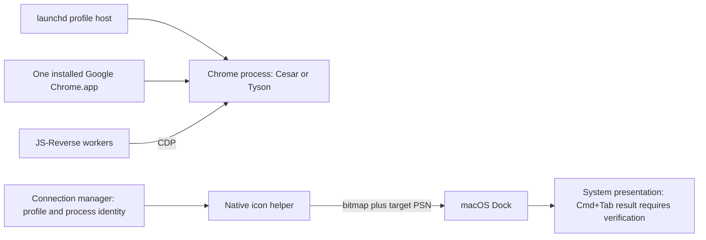

# Distinct macOS app-switcher icons with one unchanged Chrome bundle

Research date: 2026-09-12. Observed system: macOS 26.5.2 (25F84), Apple Silicon;
Google Chrome 153.0.8010.37. This is a research result and proposed mechanism,
not a deployed icon feature.

## Binding invariant

The daily browser, Cesar, and Tyson must all execute
`/Applications/Google Chrome.app/Contents/MacOS/Google Chrome` from the same
installed `/Applications/Google Chrome.app` bundle. Preserve the executable,
bundle metadata, Google signature, Chrome update path, existing profile roots,
and current launchd ownership.

Do not substitute browser copies, renamed bundles, different Chrome channels,
re-signed builds, or a different LaunchServices bundle path. This constraint is
recorded in [the accepted browser architecture](../adr/0001-shared-profile-browsers.md).

## Result

The strongest native candidate is an **external helper that supplies per-process
bitmaps to the Dock through its private Mach protocol**. It changes presentation
owned by the Dock; it does not need code inside Chrome or changes to Chrome's
application bundle.

A bounded prototype sent two different bitmaps to two processes executing from
one identical native test-app bundle. The sends returned success, and the Dock
logged `SetProcessBitmap` for both target process serial numbers. **The actual
Cmd+Tab images have not been visually confirmed.** That distinction prevents
promoting this prototype into a working production feature prematurely.

Old `CoreDockSetProcessImage` recipes are conclusively unsuitable on this build:
the exported function immediately returns `-50`. The useful current path lies
under AppKit's bitmap drawing mechanism, not that legacy image setter.

There is no public AppKit setter for another application's icon. Public API
absence does not establish that a private mechanism is impossible; the installed
implementation and the prototype provide a more specific answer.

## The relevant model

An **application bundle** contains code, resources, and default application
metadata. A **browser instance** runs that code with a particular user data
directory. A **process incarnation** is one execution, identified using a PID
and its start time; a PID alone can later refer to something else.

The Dock maintains presentation state for running applications separately from
their executable files. In the observed private protocol, the target is a
macOS **process serial number** (PSN). A PSN is unrelated to a CDP session ID.
The proposed helper speaks to the Dock, while JS-Reverse continues speaking CDP
to Chrome.



## Verified observations

### The three browsers already share one bundle

At the initial inventory, macOS reported all three with bundle identifier
`com.google.Chrome`, bundle URL `/Applications/Google Chrome.app`, and the same
executable URL. Their PIDs were 88513 (daily), 950 (Cesar), and 2429 (Tyson).
The profile attribution came from the live process arguments, not from their
identical display names.

Chrome's installed Info.plist contains both `CFBundleIconFile = app.icns` and
`CFBundleIconName = AppIcon`. Chromium's version-matched
[icon documentation](https://github.com/chromium/chromium/blob/b75a5a95ea1a1b55bdbfd6d9f42d47be7507fb8b/docs/mac/icons.md)
explains its macOS 26 asset-catalog/Icon Composer representation. Editing the
legacy `.icns` file would neither preserve the invariant nor reliably select
the icon source used by macOS 26.

### Public API contracts are narrower than the requested operation

- [`NSApplication.applicationIconImage`](https://developer.apple.com/documentation/appkit/nsapplication/applicationiconimage)
  changes the calling application's Dock image. It is an in-process property;
  Apple does not document a Cmd+Tab guarantee for it.
- [`NSDockTile`](https://developer.apple.com/documentation/appkit/nsdocktile)
  exposes Dock content and badges. It does not expose a target-PID setter.
- [`NSRunningApplication.icon`](https://developer.apple.com/documentation/appkit/nsrunningapplication/icon)
  is read-only. Inspection of its installed implementation showed that it
  obtains the file icon through `NSWorkspace.iconForFile:` using the bundle or
  executable URL. **Its image digest is not a readback of a dynamic Dock bitmap.**
- [`NSWorkspace.setIcon`](<https://developer.apple.com/documentation/appkit/nsworkspace/seticon(_:forfile:options:)>)
  changes the icon of a filesystem item. Applying it to the one shared Chrome
  bundle cannot independently label Cesar and Tyson.

### The old private image setters are stubs

The macOS SDK exports `CoreDockSetProcessImage`, `CoreDockCompositeProcessImage`,
and `CoreDockRestoreProcessImage`. In the actual installed arm64e HIServices
image, each consists of:

```asm
mov w0, #-0x32
ret
```

This is direct observation of macOS 26.5.2, not an inference from an old forum
post or symbol name. The HIServices UUID is
`34C40608-353D-3A06-BBF1-6B927CB8B39D`.

`CoreDockSetProcessLabel` has a real implementation, but its name and existence
do not establish an icon operation or a suitable external target interface.

### The active bitmap path still exists

Read-only inspection of AppKit and HIServices in the current process showed:

```text
NSApplication.setApplicationIconImage
  -> _setApplicationIconImage:setDockImage:
  -> NSDockTile.display
  -> CoreDockGetProcessContext
  -> CGContext flush callback: _processDockIconFlush
  -> _DSSetProcessBitmap
  -> Mach service com.apple.dock.server
```

`CoreDockGetProcessContext` works with a process-local context. Its normal flush
callback obtains the calling process's PSN. The lower-level message contains a
PSN field, which led to the external-target experiment.

The observed message ID is `0x1791b`. Its packed size is 80 bytes, including one
out-of-line bitmap descriptor, NDR data, the PSN at offset 52, and bitmap
parameters. The prototype uses the same 16-bit floating-point bitmap format
(`0x1101`) observed in HIServices. These are private, build-specific facts,
not a stable Apple SDK contract. `_DSSetProcessBitmap` is not an exported API;
the prototype sends the reconstructed message instead of calling a hardcoded
function address inside a framework.

AppKit's UUID on this machine is `C92CC156-D767-322B-B79B-433F56E72561`.

### What the prototype proved

The two fixture processes used the exact same `Icon Fixture.app` and executable.
Both initially set a Chrome image through their own public AppKit property.
A separate sender then requested a Calculator image for fixture A and a TextEdit
image for fixture B. The sender refuses every executable path except this
specific disposable fixture, so it cannot be pointed at the live browsers.

| Check                                              | Observation                                                                |
| -------------------------------------------------- | -------------------------------------------------------------------------- |
| Same test bundle and executable                    | Confirmed for PIDs 6636 and 6638                                           |
| Distinct targets                                   | PSNs `(0, 0x3bb3bb)` and `(0, 0x3bd3bd)`                                   |
| External bitmap sends                              | Both returned Mach status 0                                                |
| Dock received the target messages                  | Recorded in Dock's service log                                             |
| File-icon readback                                 | Still identical for both fixtures, as expected from the API implementation |
| Visible Cmd+Tab result                             | Not confirmed                                                              |
| Authenticated Chrome processes changed             | No                                                                         |
| Installed browser or launchd configuration changed | No                                                                         |

A successful one-way send is a transport result, not a rendering assertion.
Dock receipt likewise does not prove which representation Cmd+Tab selected.
The current UI tooling did not provide a verified capture of the system switcher.
The optional user observation has not supplied confirmation. Both fixtures closed
during cleanup; a fresh process check confirmed that the original three Chrome
processes were still running from their original executable.

The [machine observations](evidence/macos-26-icons/observations.json),
[process inventory](evidence/macos-26-icons/fixture-inventory.json),
[Dock log](evidence/macos-26-icons/dock-events.txt),
[fixture source](evidence/macos-26-icons/fixture.m), and
[restricted sender source](evidence/macos-26-icons/dock-bitmap-probe.m)
are retained for review. They are research artifacts and are not included in
the installed manager. To repeat the bounded visual check from a terminal, run:

```sh
python3 docs/research/evidence/macos-26-icons/run-probe.py
```

The runner builds the two test programs, launches two instances of the same
fixture bundle, sends the two icon requests, and stays alive for three minutes
so Cmd+Tab can be inspected. Ctrl+C closes only its own fixture processes.
It refuses OS builds other than the one researched here. `--build-only` compiles
without launching anything. The sender itself restricts targets to the fixture's
exact executable path. This reproduces the transport experiment; it does not
automatically verify the switcher's appearance.

## Other mechanisms and tricks

| Mechanism                                              | Preserves the shared Chrome bundle?                                 | Evidence and decision                                                                                                           |
| ------------------------------------------------------ | ------------------------------------------------------------------- | ------------------------------------------------------------------------------------------------------------------------------- |
| External Dock bitmap message                           | Yes                                                                 | Strongest current native candidate; delivery verified, switcher rendering and lifecycle still require acceptance                |
| Legacy CoreDock image setters                          | Yes                                                                 | Immediate error-return stubs on this OS build; ruled out here                                                                   |
| LaunchServices per-process metadata                    | Potentially                                                         | Real metadata SPI exists, but no verified icon key or current icon-setting client was found                                     |
| Set an icon before `exec` into Chrome                  | Potentially                                                         | PID survives, process memory is replaced; persistence of Dock-owned bitmap state across Chrome registration is untested         |
| Inject an AppKit icon setter into Chrome               | Same path, but incompatible with preserving its current protections | Installed Chrome's hardened runtime and entitlements do not provide the needed DYLD/library-validation exceptions               |
| Proxy apps plus hiding the real managed Chrome entries | Browser executable can stay unchanged                               | Adds surrogate application identities and complex focus/quit behavior; hiding external entries still relies on private behavior |
| A custom Cmd+Tab switcher                              | Yes                                                                 | Owns its display and can label the known Chrome PIDs; replaces a system interaction and needs a separate UX/permission decision |
| Change bundle assets, IDs, or use copies/channels      | No                                                                  | Excluded by the invariant                                                                                                       |

LaunchServices deserves a precise qualification. Apple's WebKit source declares
and uses `_LSSetApplicationInformationItem` for process display names:
[the SPI declaration](https://github.com/WebKit/WebKit/blob/a371ed314175328578fc843fa4914cb114715964/Source/WebCore/PAL/pal/spi/cocoa/LaunchServicesSPI.h)
and [the WebProcess client](https://github.com/WebKit/WebKit/blob/a371ed314175328578fc843fa4914cb114715964/Source/WebKit/WebProcess/cocoa/WebProcessCocoa.mm).
That establishes metadata operations, not arbitrary external icon replacement.
The installed `lsappinfo` documentation supplies no icon operation. Altering
Chrome's reported bundle path to trick icon lookup is excluded here even if its
executable path could remain unchanged.

The launcher/`exec` idea is not proven impossible by memory replacement alone:
the Dock's bitmap is outside the launcher's address space. However, no public
contract preserves it across `exec`, Chrome's fresh registration, or a Dock
restart. Applying a verified external operation after Chrome registers would
avoid depending on that uncertain handoff.

For injection, Apple's
[DYLD entitlement documentation](https://developer.apple.com/documentation/bundleresources/entitlements/com.apple.security.cs.allow-dyld-environment-variables)
and [library-validation documentation](https://developer.apple.com/documentation/bundleresources/entitlements/com.apple.security.cs.disable-library-validation)
explain the required runtime exceptions. The installed Google-signed main
executable has hardened-runtime/library-validation flags and lacks those
exceptions. Re-signing it to add them is outside this design. Page JavaScript
and CDP do not provide an AppKit object bridge into Chrome's native browser
process.

## Proposed mechanism and reliability boundary

Keep the existing launchd browser hosts and manager. If the native switcher
acceptance test passes, add a small native **icon helper** with these properties:

1. **Authoritative targeting.** The profile host publishes the actual Chrome
   browser PID, distinct from the Node host PID. The manager associates it with
   Cesar or Tyson. Before every update, the helper checks the executable and
   bundle paths, user, process start time, and profile ownership. It obtains a
   fresh PSN for that exact incarnation. A recycled PID must never receive an
   old profile's image. Do not select the first `com.google.Chrome` process.
2. **Presentation only.** Send a static, visibly distinct C/Cesar or T/Tyson
   image to the Dock. Leave the daily Chrome entry alone. Do not change browser
   files, entitlements, profile data, LaunchServices bundle identity, or CDP
   state. This helper does not replace the manager's three-level connection tree.
3. **Explicit compatibility.** Isolate the private message in one adapter with
   a recorded OS/build and binary-UUID compatibility check. Verify the packed
   message layout at compile time. Unknown builds disable the icon feature
   while the browser and debugging continue. A symbol resolving is insufficient.
4. **Lifecycle recovery.** Reconcile when the managed browser incarnation or
   Dock incarnation changes. Wait for application registration, then apply with
   bounded retries. Test whether Chrome's own Dock redraws, downloads, badges,
   appearance changes, or wake events overwrite it; do not assume the first
   successful send makes the override permanent.
5. **Clear status and restore.** Expose unsupported, pending verification, and
   active states in the menu extra. The paired private remove-bitmap path was
   observed but has not been tested; restoration and target-exit cleanup must be
   verified before deployment. Never use global Dock restarts or icon-cache
   deletion as routine recovery.

A helper crash must not terminate Chrome or disconnect JS-Reverse. A failed icon
operation should leave ordinary Chrome icons and the existing profile labels
in the manager. There is no need to disable system security protections or
intercept the user's global Cmd+Tab shortcut for this candidate.

This is the proposed trade-off: preserve the original browser and the native
switcher while maintaining a small, explicitly versioned private Dock adapter.
It cannot honestly be promised to work across future macOS releases without
retesting. If Cmd+Tab ignores the bitmap, do not deploy this adapter. The other
native tricks remain unverified; a separate switcher would be an independently
chosen fallback, not an automatic installation.

## Acceptance before deployment

The remaining checks are concrete:

- Observe two simultaneous same-bundle fixture entries with distinct icons in
  Cmd+Tab, then verify restoration. Repeat after fixture replacement and verify
  that a stale PID/start-time pair is rejected.
- Repeat with temporary, empty user-data directories using the canonical,
  unchanged Chrome executable. Confirm Cmd+Tab, CDP, helper processes, and clean
  shutdown. Use the source-verified `--disable-updater-scheduler` for temporary
  research launches; do not modify normal Chrome updating.
- Exercise Chrome redraw/download progress, appearance changes, Spaces,
  sleep/wake, browser relaunch, and Dock relaunch in an isolated acceptance run.
  Confirm the intended icons recover without touching the daily browser.
- Only after those pass, attach the helper to the existing supervised Cesar and
  Tyson processes and verify their current browsing state and the full manager
  tree remain intact.

No icon feature is installed by this research. The only accepted architecture
change here is the explicit shared-bundle invariant.
